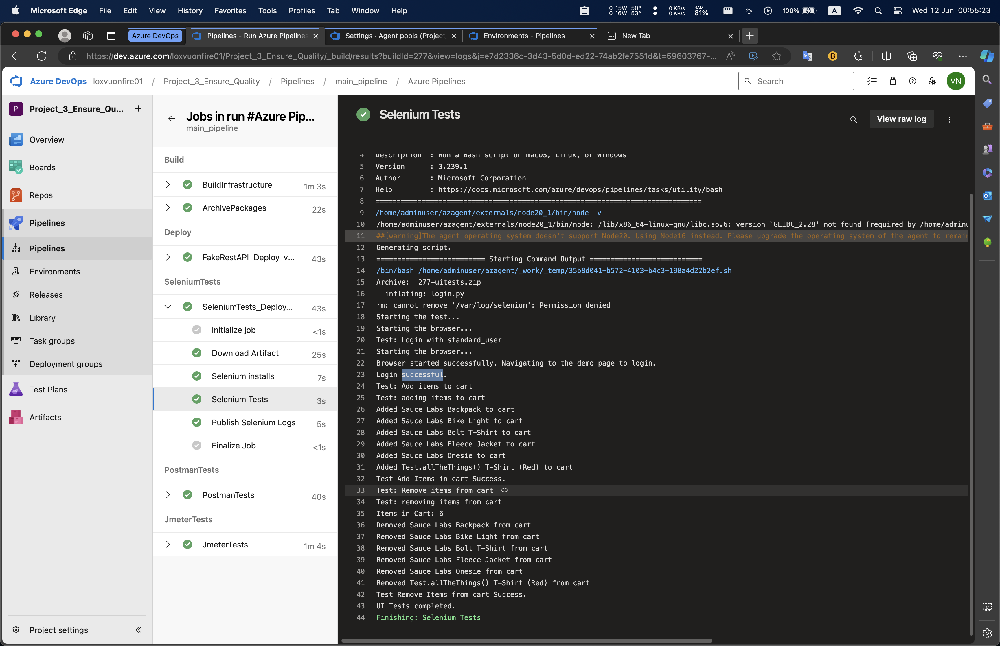
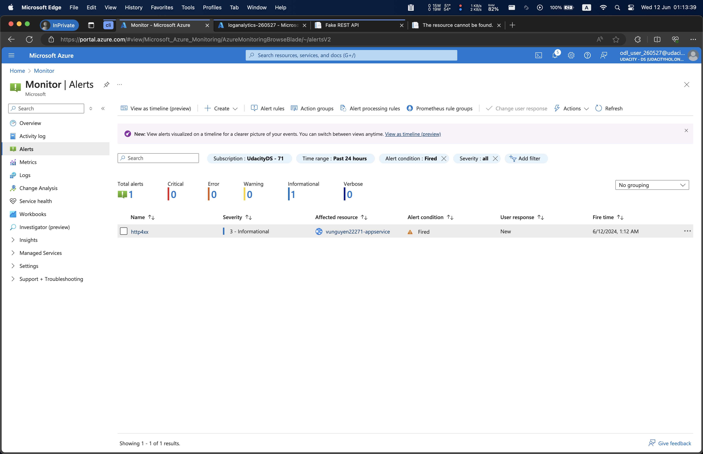
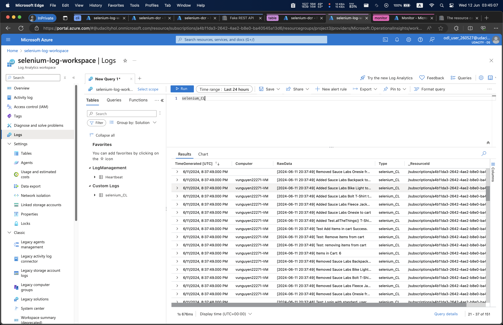

# Building CICD Piepline to Deploy ML with Azure DevOps

# Overview
This is Project 3 of the Udacity DevOps Nanodegree - Cloud DevOps using Microsoft Azure. 

## Architecture Diagram

Source: Udacity

In this project, we build a CI/CD pipeline with Ensuring Quality by integrating Azure DevOps with GitHub, Observability, and Monitoring with Azure Monitor and Log Analytics Workspace, and Deployment with Azure App Service.

## Rubric
### 1. Environment Creation & Deployment

#### 1.1 Screenshot of the log output of Terraform when executed by the CI/CD pipeline

#### 1.2 azure-pipelines.yaml - screenshot of the successful execution of the pipeline build results page

### 2. Automated Testing
#### 2.1 Jmeter: Screenshot of the log output of the test results when executed by the CI/CD pipeline

Note: I store Jmeter test results at: ./automatedtesting/jmeter/log/jmeter

- Stress Test

- Endurance Test

#### 2.2 Selenium: Screenshot of the execution of the test suite by the CI/CD pipeline.

#### 2.3 Postman: Three screenshots of the Test Run Results from Postman shown in Azure DevOps
- Run Summary page (which contains 4 graphs)

- Test Results page (which contains the test case titles from each test)

- Publish Test Results step

### 3. Monitoring & Observability
#### A. Azure Monitor
#### 3.1 screenshots of the email received when the alert is triggered

#### 3.2 The graphs of the resource that the alert was triggered for (be sure to include timestamps for the email and the graphs)

#### 3.3 The alert rule, which will show the resource, condition, action group, alert name, and severity

#### 3.4 Screenshots for the resource’s metrics will correspond to the approximate time that the alert was triggered.

#### B. Azure Log Analytics
#### 4.1 Screenshots of log analytics queries and result sets which will show specific output of the Azure resource

